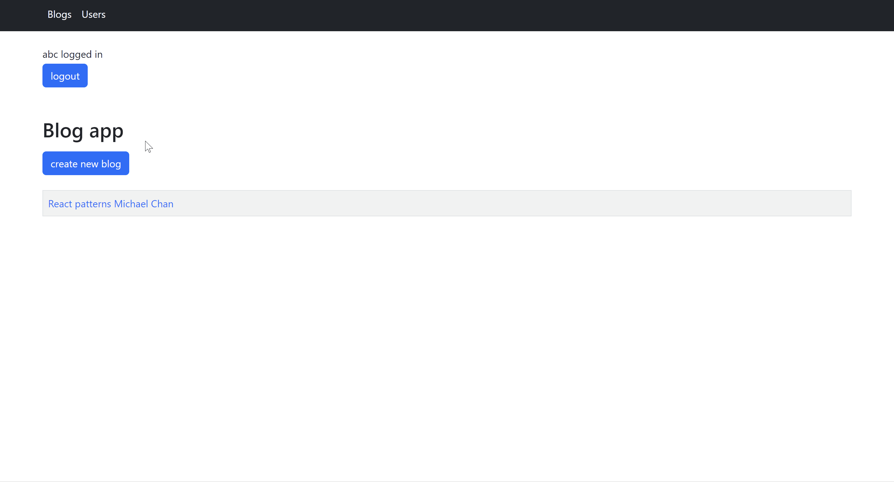

# Bloglist

Bloglist is a web application designed for users to create and manage information about blogs discovered across the internet. Users can store details about these blogs, engage by liking and commenting on them.

This is one of the projects in the [Full Stack Open](https://fullstackopen.com/en/) online course.

For more projects related to Full Stack Open, please visit the [fullstackopen](https://github.com/wengcychan/fullstackopen.git) repository.

## 📸 Screenshots

## 🛠️ Technologies Used

- React
- Nodejs
- MongoDB
- Jest
- Cypress
- Redux
- Bootstrap

## 🚀 Installation

1. Clone the repository
2. Navigate to the frontend with `cd bloglist-frontend`
3. Install frontend dependencies with `npm install`
4. Run the frontend development server with `npm run dev`
5. Navigate to the backend with `cd bloglist-backend`
6. Install backend dependencies with `npm install`
7. Run the backend development server with `npm run dev`
